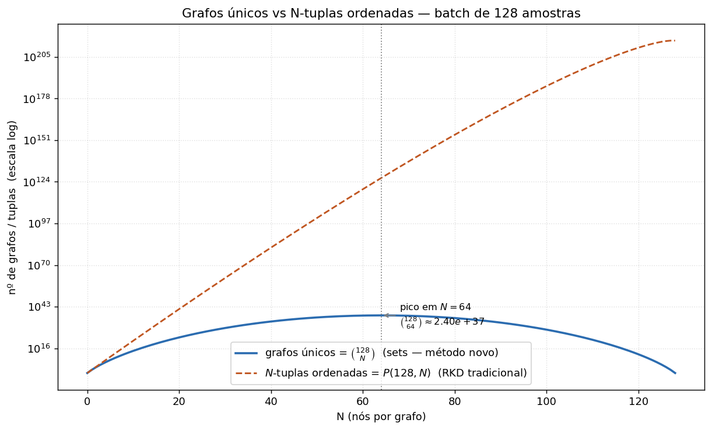

# Graph-RKD — escolha do número de nós (N) e combinatória

Generalização do Relational Knowledge Distillation: cada **nó** é um objeto
(amostra do batch), cada **aresta** é a distância entre os embeddings de dois
objetos, o grafo é completo e não-direcionado, e seu embedding é **invariante a
permutação** (mesmo conjunto de nós ⇒ mesmo embedding). Logo um grafo é um
*conjunto* de N nós, não uma tupla ordenada.

Os métodos de *embedding* desses grafos entram depois; este pacote cobre a
**escolha de N** (busca binária) e a **análise combinatória**.

## Combinatória (e uma correção importante)

Para um batch de B amostras e grafos de N nós:

| | fórmula | B=128, N=8 |
|---|---|---|
| grafos únicos (sets — método novo) | `C(B, N)` | 1.43×10¹² |
| N-tuplas ordenadas (RKD tradicional) | `P(B, N) = N!·C(B, N)` | 5.76×10¹⁶ |

- O nº de grafos únicos é **`C(B, N)`** — combinatório, com **pico em N = B/2**
  (`C(128,64) ≈ 2.4×10³⁷`). Ou seja, o *espaço* de grafos possíveis **não** é
  pequeno nem "não-exponencial".
- A vantagem real da invariância a permutação é o **fator N!**: cada grafo
  substitui N! tuplas ordenadas. No RKD tradicional, relações N-árias ordenadas
  custam O(Bᴺ) (exponencial em N); com sets você processa cada grafo uma vez.
- E o **custo por passo** só não explode se você **amostra um nº fixo de grafos**
  (ou particiona o batch) em vez de enumerar `C(B,N)`. Veja o modelo de custo.

Gráfico `C(128,N)` vs `P(128,N)`: 
(gerado por `plot_unique_graphs(128)`).

## Busca binária pelo melhor N

Busca binária acha uma **fronteira monotônica**, não o máximo de uma função
monotônica. Como assumimos que a qualidade cresce com N, "melhor N" = **maior N
viável sob uma restrição** (orçamento de compute/memória). `find_best_n` faz
isso em O(log B) avaliações:

```python
from graph_rkd import find_best_n

# modelo de custo (default): orçamento em arestas/passo
find_best_n(batch_size=128, edge_budget=1024)          # -> 17

# medição REAL (quando tiver GPU + os métodos de embedding):
#   feasible_fn(N) deve ser monotônico: True enquanto couber (sem OOM / tempo ok)
find_best_n(128, edge_budget=0, feasible_fn=lambda N: roda_um_passo_ok(N))
```

Se houver **retornos decrescentes** (qualidade não é "∝ N" puro), use
`find_knee_n(quality_fn, ...)`: busca binária pelo maior N cujo ganho relativo
de qualidade ao dobrar N ainda supera `rel_tol` (o "joelho" da curva).
`quality_fn(N)` é uma medição real (ex.: recall/top-1 do student).

## Regra matemática derivada

Esquema **partition** (cada amostra usada 1×): o batch é dividido em ⌊B/N⌋
grafos completos disjuntos `K_N`. Arestas por grafo = `C(N,2) = N(N-1)/2`, logo:

```
E (arestas/passo) = (B/N) · C(N,2) = B·(N-1)/2          (exato quando N | B)
```

Note que **E cresce só linearmente em N** (dobrar N ≈ dobra o custo, pois o nº de
grafos cai pela metade) — é nesse sentido preciso que "não cresce
exponencialmente" vale. Resolvendo para o maior N sob orçamento E:

```
B·(N-1)/2 ≤ E   ⟹   N* = ⌊ 2E/B + 1 ⌋     ⟹     (N*-1)·B = 2E = const
```

Ou seja **N\* é afim em 1/B** (`N* ≈ 2E/B + 1`). O ajuste empírico de
`derive_scaling_rule` sobre B ∈ {128…2048} reproduz isso **exatamente**
(`N* ≈ 2048·(1/B) + 1.00`, R² = 1.0000, resíduo ~10⁻¹⁴ para E=1024).

Esquema **sample** (G grafos fixos de N nós): `E = G·C(N,2)` ⟹
`N* ≈ sqrt(2E/G)`, **independente de B**.

> Estas regras vêm do *modelo de custo* (proxy = nº de arestas). Quando os
> métodos de embedding e a GPU estiverem disponíveis, troque o predicado por uma
> medição real (`feasible_fn`/`quality_fn`) e re-derive — a forma funcional
> (afim em 1/B para partition; constante para sample) deve se manter se o custo
> do embedding for ~linear no nº de arestas.

## Embeddings de grafo (invariantes a permutação)

Dois embeddings determinísticos do grafo inteiro a partir da matriz de
distâncias (`embeddings.py`), ambos em **PyTorch e diferenciáveis** (o lado do
student precisa de gradiente):

1. **`node_profile_embedding(D, sort_key="lex")`** — Perfil de Nós Ordenado.
   Ordena as distâncias dentro de cada nó (perfil de vizinhança), ordena os
   perfis entre si e achata. Tamanho fixo `N·(N-1)`.
   - **Padrão `sort_key="lex"` (lexicográfica), não `"mean"`.** Ordenar por média
     **quebra a invariância em empates** (`argsort` desempata pela posição
     original → muda sob embaralhamento). O selftest demonstra: com médias
     empatadas, `mean` dá diferença `2.0` sob permutação; `lex` dá `0.0`. A
     opção `"mean"` existe só para paridade com o código de referência.
2. **`mds_spectral_embedding(D)`** — autovalores do MDS clássico (espectro da
   Gram após dupla-centralização de D²), em ordem decrescente. Tamanho fixo `N`.
   Invariante por similaridade de permutação.

Para destilação, passe `normalize=True` (default na perda): normaliza cada
matriz pela distância média, tornando o embedding **escala-invariante** — sem
isso a perda compararia a escala das distâncias (teacher 512-d vs student
192-d), não a geometria.

Validação (`python -m graph_rkd.selftest`): paridade exata com o numpy de
referência; invariância (A vs embaralhado = 0) e sensibilidade (A vs B > 0) para
os dois métodos; gradiente finito e não-nulo; e a perda → 0 quando
student == teacher.

## Perda de destilação Graph-RKD

`GraphRKDLoss(method="profile"|"mds", n_nodes=N, sampling="partition"|"random", ...)`
generaliza o RKD: casa o embedding do grafo de N nós entre teacher e student
(mesmos índices nos dois lados), em vez de pares (RKD-D) ou trios (RKD-A).

```python
from graph_rkd import GraphRKDLoss, find_best_n

N = find_best_n(batch_size=128, edge_budget=1024)   # ex.: 17
graph_rkd = GraphRKDLoss(method="profile", n_nodes=N, sampling="partition")

# no loop de treino (student_emb, teacher_emb: (B, d)):
loss_graph = graph_rkd(student_emb, teacher_emb)     # teacher sem grad internamente
```

Para plugar no `distill_to_convnextmicro.py`: use os embeddings agrupados do
aluno/professor (`forward_features(...)["embedding"]`) e some `graph_rkd_ratio *
loss_graph` à perda total — no lugar de (ou junto com) `dist_ratio`/`angle_ratio`.

## Perda contrastiva por amostragem (InfoNCE) — `contrastive.py`

Alternativa **leve e contrastiva** à regressão acima (estilo GraphSAGE/PinSage/
CRD): o custo é **O(G·M)** (G grafos, M negativos), independente do espaço de
grafos. Importante: a `GraphRKDLoss` por regressão **já é O(G)** — o ganho do
contraste não é evitar fatorial (nunca enumeramos C(B,N)), e sim (a) limitar as
comparações *entre* grafos a M negativos e (b) o objetivo contrastivo costuma
destilar melhor que regressão (CRD).

Enquadramento **cross-model** (destilação): âncora = grafo i do *student*;
positivo = mesmo grafo i do *teacher*; negativos = M grafos j≠i do *teacher*
(amostrados). Como o embedding do grafo só depende de N, âncora e positivo
estão no mesmo espaço (cosseno direto).

```python
from graph_rkd import GraphContrastiveDistillLoss, find_best_n
N = find_best_n(128, edge_budget=1024)
crit = GraphContrastiveDistillLoss(method="profile", n_nodes=N,
                                   num_negatives=10, temperature=0.07)
loss_graph = crit(student_emb, teacher_emb)        # (B, d) cada
```

Notas de implementação (vs. o protocolo de referência):
- **Vetorizado** (sem `for` por amostra): negativos via `randint (A, M)` + gather.
- **InfoNCE estável** com `cross_entropy(logits, 0)` — provado idêntico à
  fórmula `-log(pos/(pos+Σneg))` sobre os mesmos negativos (selftest).
- **`exclude_index`**: evita sortear o próprio positivo como negativo (viés que o
  `torch.randint` cru do protocolo de referência tem).
- `SampledGraphContrastiveLoss(temperature, num_negative_samples)` é a classe
  genérica com a assinatura `(anchor, positive, pool)` pedida.

## Experimentos: loss padrão + Graph-RKD, busca binária de N

`distill_to_convnextmicro.py` aceita a loss de grafo via flags
(`--graph_rkd_mode {regression,contrastive}`, `--graph_rkd_method {profile,mds}`,
`--graph_rkd_nodes N`, `--graph_rkd_ratio`, `--num_negatives`, `--temperature`),
somada à loss padrão (CE + Hinton KD). Distância euclidiana.

O orquestrador `run_graph_rkd_search.py` roda, para cada (modo × método), a
**busca binária de N**: teto por orçamento (`find_best_n`) e "joelho" por
qualidade de **validação** (`find_knee_n`), com uma run curta por candidato e
uma run longa no N escolhido.

**Loss usada nos experimentos: só cross-entropy + a loss de grafo.** O
orquestrador desliga KD, RKD-D, RKD-A e attention (`kd/dist/angle/at = 0`), então
a única componente relacional é a do grafo.

**Temperatura da InfoNCE contrastiva:** **constante por padrão** (`--temp_start`,
τ=0.07) — é o baseline limpo, alinhado com SimCLR/MoCo/CRD. O **agendamento** é
uma **ablação opcional** (`--temp_schedule {linear,cosine,exp}` + `--temp_end`),
logada em `train/graph_temperature`. Cuidado ao interpretar: baixar τ amplifica o
gradiente por ~1/τ, então o schedule se confunde com a escala do LR; e a
regressão não tem temperatura (a comparação reg×contr fica mais limpa com τ fixa).

```bash
TEACHER_ARCH=resnet18 DATASET=cub200 bash examples/graph_rkd_search.sh
```

Saída: tabela `(modo, método) -> N*, val@final`. Atenção: dispara muitas
destilações (use GPU; ajuste `--search_epochs`/`--final_epochs`).

## API

Escolha de N / combinatória:
- `unique_graphs(B, N)` / `ordered_tuples(B, N)` / `permutation_reduction(N)`
- `step_edge_cost(B, N, scheme, graphs_per_step)`
- `largest_feasible_n(predicate, lo, hi)` — busca binária monotônica genérica
- `find_best_n(batch_size, edge_budget, scheme, ..., feasible_fn=None)`
- `find_knee_n(quality_fn, lo, hi, rel_tol)`
- `derive_scaling_rule(batch_sizes, edge_budget, scheme, graphs_per_step)`
- `plot_unique_graphs(B, path)`

Embeddings de grafo / perda:
- `pairwise_distance_matrix(node_emb, squared)` / `normalize_distance_matrix(D)`
- `node_profile_embedding(D, sort_key, normalize)` (Método 1)
- `mds_spectral_embedding(D, normalize, jitter)` (Método 2)
- `node_profile_embedding_np(D)` (referência numpy) / `embed_graphs(...)`
- `sample_graphs(B, n_nodes, sampling, ...)` / `GraphRKDLoss(...)` (regressão)
- `SampledGraphContrastiveLoss(...)` / `GraphContrastiveDistillLoss(...)` (InfoNCE)

Demo: `python graph_rkd/node_search.py` · Testes: `python -m graph_rkd.selftest`.
